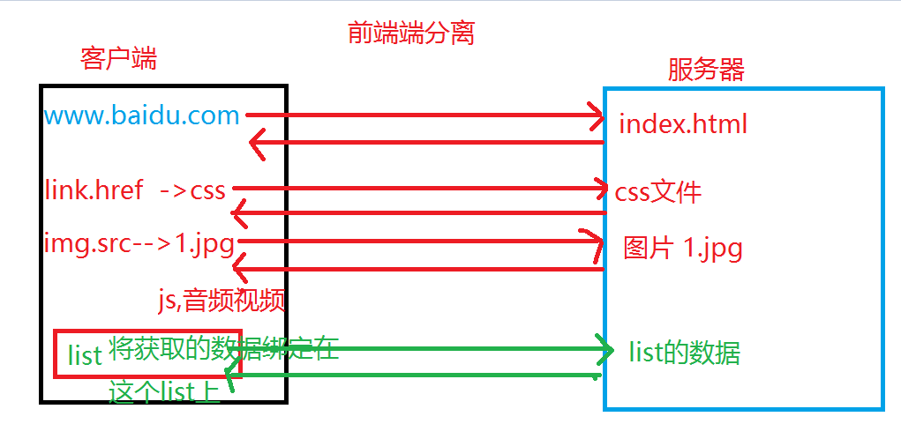
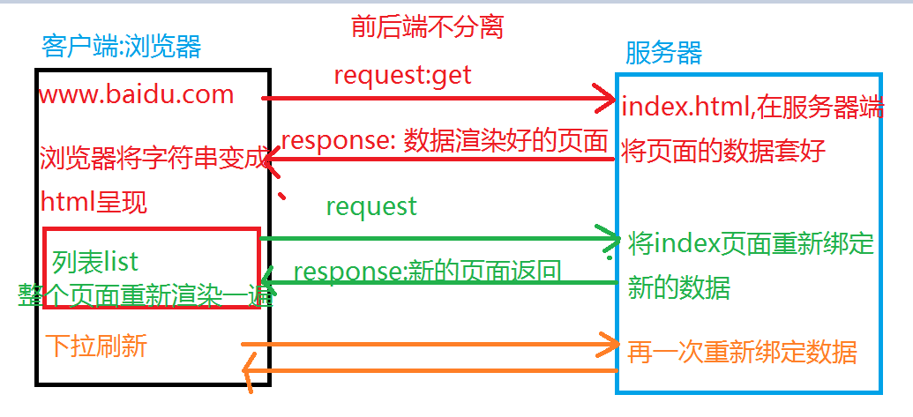
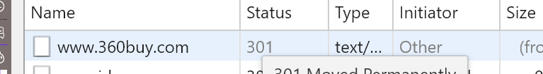
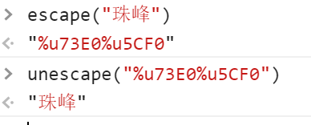
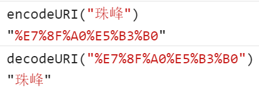
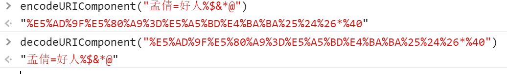

##AJAX基础知识和核心原理(2017)
###AJAX基础知识
####1.什么是AJAX?
> Async Javascript And XML 异步的JS和XML
> XML? 可扩展的标记语言(自定义的一些标签包裹数据,服务器传递数据)
```
<?xml version="1.0" encoding="UTF-8" ?>
<root>
    <student>
        <name>王小二</name>
        <age>12</age>
        <sex>男</sex>
    </student>
</root>
```
> Ajax异步的概念
`局部刷新`:数据传递的是JSON字符串,前后端分离
1).向服务器发送AJAX请求
2).将服务器返回的数据经过前端的解析处理,绑定到页面上
3).页面只需要改变一部分,整个页面不需要重新渲染


`全局刷新`:页面的整体刷新.在之前没有前后端分离,当页面上数据改变的时候,向后台发送请求,后台会将页面的数据重新渲染一遍,将渲染好的页面返回给客户端,呈现出来,这叫全局刷新,也是前后端不分离,这就要求后台去套数据,一般会使用jsp来套数据


###前后端分离和不分离的优势和弊端
####1.不分离的优势
>1.页面上的数据都是由服务器渲染好的,所以说源代码上能看到数据,有利于SEO优化(搜索引擎的收录和抓取)
>2.从服务器上获取的页面已经是渲染好数据的了,不需要客户端再去额外的请求,所以页面加载速度比较快(前提是服务器得够快),一般像京东,淘宝这样的页面首屏都是前后端不分离的处理,直接渲染好页面给前端返回
####2.不分离的弊端
>1.如果页面有很多内容需要改变,需要实时获取数据,每一次更新数据都要重新刷新一下页面,这样肯定不好
>2.每一次都是由服务器渲染数据的,对服务器的要求比较高,服务器的压力比较大,如果服务器处理不过来,就会容易加载变慢或者服务器崩了,所以京东淘宝这样的页面,只有首屏才会这么处理,其他的还是前后端分离,由前端来渲染数据 .
>3.目前市场上大部分都是前后端分离的项目,我们公司也是前后端分离,但是也有一些还在不分离的状态

####3.分离的优势
>1.我们可以根据需求任意改变页面中某一部分的数据更新,而不用刷新整个页面(例如实时刷新),性能好,体验也好(表单提交就是基于ajax实现的)
>2.有利于开发,提高开发效率
>1).开发的时候前后端互不影响,不需要考虑各自使用的技术,也相当于实现了技术的分离
>2).可以进行同时开发:项目开始的时候,需要前后端制定一下交互文档(API文档).文档说的比较详细包含请求的URL.请求方式,以及参数字段和返回数据格式,我经常会使用node自己模拟一下接口和数据,为了保证页面能正常跑通
####4.分离的弊端
>1.不利于SEO优化(注意:后期使用JS将数据绑定到页面上,不会在源代码上体现,所以不会被SEO收录和抓取)
>2.刚开始请求资源文件的时候请求次数如果过多也会影响页面的加载速度,为了防止加载速度过慢我们一般都进行优化处理,
>怎么优化去看之前发的优化文档
###基于原生实现AJAX
```
//创建一个AJAX对象
let xhr=new XMLHttpRequest();
//不兼容 IE6以及以下(使用ActiveXObject)
 
//打开一个URL地址
//xhr.open("method","url",async,user.name,user.password)

xhr.onreadystatechange=()=>{
    if(xhr.readyState==4&&xhr.status==200){
        let res=xhr.responseText;//获取响应主体的内容
    }
};
//发送请求 (请求主体的内容的数据)
xhr.send(null)
```
**` 分析第二步的参数`**
####1.method:AJAX的请求方式
>1).GET系列(拿数据)
> - get 
> - delete  从服务器器上删除某些文件
> - head   获取响应头信息(响应主体不需要只要响应头)
> - ......
>2).POST系列(推送数据)
> - post
> - put: 向服务器添加指定的资源文件
> - ....
>不管是 哪一种方式都可以向服务器发送数据也可也以获取数据,但是一般GET系列以获取为主(给的少拿的多),相反POST系列就是以发送数据为主(给的多拿的少)
>1)我们想获取一些动态展示的数据(例如获取一个新闻列表的数据)一般使用GET请求,因为只需要告诉服务器我们需要什么,就给你返回需要的内容
>2)当页面上有大量信息需要发送给服务器(例如,表单提交注册信息等),服务器接受到数据只需要返回成功或者失败的状态,这个时候一般使用POST请求
>..
>GET和POST具体哪些区别
> 1.get请求服务器发送的内容比post少,
> 原因: 
> - 因为get请求参数是拼接在url的,通过url的参数形式来传递数据的,但是url的大小是有限制的(谷歌8KB,火狐7KB,IE2KB...)一旦超过大小限制就会默认剪切掉,发送的数就不全了
> - post 发送的数据是通请求主体实现的,理论上大小是没有限制的,但是真实项目中为了保证传输数据的速度,我们也会加点限制(例如上传资料图片等的时候后台服务器自己做一下特殊处理)
> 2.缓存问题 get请求容易走缓存,post不会
>  - get 通过url传参数的方式请求数据,当遇到实时获取数据的时候,因为url是一样的参数也是一样的,此时浏览器就会默认读取缓存中的内容去返回给你,获取的就不会是服务器最新的数据,一般我们都是在参数后面加一个时间戳来防止走缓存
>  - 但是post请求不会,因为请求的数据放在请求主体中,是不会走缓存的
>  3.安全性 GET请求没有POST请求安全
>  - get的参数在url上,有一些比较简单的黑客技术,拦截URL(URL劫持).也可以把客户端传递的信息获取到导致信息泄露
>  - post信息都在请主体中你是看不到的
####第二个参数 URL
`这个url地址就是后台给你的地址,一般都会有一个API文档,按照文档写即可`
####第三个参数async
> async: true 默认不写就是true异步
> false :同步sync
####最后俩参数 用户名,密码
`一般不需要写,只有有一些服务器不予许匿名访问,只有开通权限的才可以访问,像一些重要机密的,银行等这样的服务器才会设置权限`
**`第三部分解析`**
```
xhr.onreadystatechange=function () {
    
};
```
> AJAX 的状态码: xhr.readyState
> - 0:未发送 只要创建一个AJAX的对象就是0,默认值就是0
> - 1: open,只要执行xhr.open就是1
> - 2:当前请求已经发送,并且接收到了响应头
> - 3:响应主体在路上
> - 4:响应主体返回到客户端完成
> HTTP网络状态码 xhr.status
> - 200:成功 一个完整的HTTP事物完成(以2开头的都是成功的状态)
> - 以3作为开头的也是成功状态,只不过是服务器做了一些处理
> - 301:永久重定向(永久转移)一般都是域名的迁移 
> - 302:临时重定向(临时转移)(在新版的HTTP中307代表临时重定向),一般是在处理服务器的负载均衡,当一个服务器处理不了了,就会将内容暂时迁移到另一个服务器处理(主要是一些图片,有一些大公司一般都是自己专门处理图片的服务器)
> - 304:从浏览器中读取缓存,把一些不经常更新的文件和图片让他走缓存,减少服务器的压力,增加页面的加载速度
> 以4开头的都是失败的,一般都是客户端的错误
> - 400:请求参数错误
> - 401:无权限访问
> -  404:访问地址不存在
> 以5开头的 一般的都是服务器的错误
> - 500 服务器未知错误
> - 503: 服务器超负载
**AJAX常用的属性和方法有哪些**
```
let xhr=new XMLHttpRequest();
console.dir(xhr);
```
> [属性]
> - readyState: 存储的是AJAX的状态码
> - responseText/responseXML:返回的响应主体的内容,只是格式不一致,我们使用不同的属性接受即可
>    + responseText 一般都是JSON字符串
>    + responseXML是XML格式的数据字符串
> - status:记录服务器返回的HTTP状态码   
> - statusText:对返回状态码status的描述
> - timeout:设置ajax请求的超时时间,假设我们设置了超时时间是3000ms,超过这个时间响应主体还没有回来,浏览器就会把请求强制断开
> [方法]
> - abort():强制中断AJAX请求
> - getAllresponseHeaders():获取全部响应头的信息(获取的是一堆字符串文本)
> - getResponseHeader("属性名");获取指定的响应头 getResponseHeader("date") 获取响应头中存储的服务器的时间
> - open()
> - overrideMimeType 重新MIME类型
> - send()
> - setRequestHeader("属性名",属性值):设置请求头
> [事件]
> - onabort():当ajax中断的时候触发的事件
> - onreadystatechange():ajax状态码发生变化就会触发的事件
> - ontimeout():当ajax超时触发的事件

```
let xhr=new XMLHttpRequest();
//xhr.setRequestHeader("cookie","珠峰培训");
//错误The object's state must be OPENED.
//设置请求头必须写在open之后 send之前
xhr.open("get","data/data.json",false);
xhr.setRequestHeader("cookie","珠峰培训");
//'珠峰培训' is not a valid HTTP header field value.
//内容不可以是中文
xhr.onreadystatechange=function () {

};
xhr.send(null);
//xhr.setRequestHeader("cookie","珠峰培训");
```
###js编码方式
> 1.escape/unescape (一般只有js支持,前端网页之间的数据传递的时候进行的中文编码和解码) 
> 2.encodeURI/decodeURI:基本上所有的语言都支持

>3.encodeURIComponent/decodeURIComponent:跟上面的一样 这个可以编译一些特殊字符,上面的不行,最长用的是这个

###ajax的异步和同步问题
> AJAX任务:发送请求到收到响应主体内容(完整的HTTP事物)
> AJAX任务开始是发送请求开始,xhr.send
```
1.同步请求 绑定监听状态的事件不可以放在send之后,因为send就已经状态为4结束了
let xhr=new XMLHttpRequest();
xhr.open("get","data/data.json",false);
xhr.send(null);
xhr.onreadystatechange=function () {
    console.log(xhr.readyState);
};

//
let xhr=new XMLHttpRequest();
xhr.open("get","data/data.json",false);
xhr.onreadystatechange=function () {
    console.log(xhr.readyState);
    //4
};
xhr.send(null);

//
let xhr=new XMLHttpRequest();
xhr.onreadystatechange=function () {
    console.log(xhr.readyState);
    //1,4
};
xhr.open("get","data/data.json",false);//0->1
xhr.send(null);
```
```
//2.异步请求 
let xhr=new XMLHttpRequest();
xhr.open("get","data/data.json");//1
xhr.send(null);
xhr.onreadystatechange=function () {
    console.log(xhr.readyState);
    //放在open之后可以监听2,3,4
};

//
let xhr=new XMLHttpRequest();
xhr.onreadystatechange=function () {
    console.log(xhr.readyState);
    //放在open之前可以监听1,2,3,4
};
xhr.open("get","data/data.json");//1
xhr.send(null);
```
**案例获取响应头的时间做秒杀**
```
let serverTime=null;
//获取服务器上的时间,只需要获取响应头即可,时间只要获取一次然后在本地在这个时间的基础上每隔1000ms加1000即可

let fn=()=>{
    serverTime+=1000;
    //1.计算当前时间和目标事件的差
    let targetTime=new Date("2018-2-9 18:00:00");
    let diff=targetTime - serverTime;
    //将事件差diff变成  XX天XX小时XX分钟XX秒  的形式
    let day=Math.floor(diff/(24*60*60*1000));
    let hours=Math.floor(diff%(24*60*60*1000)/(60*60*1000));
    let minutes=Math.floor(diff%(24*60*60*1000)%(60*60*1000)/(60*1000));
    let seconds=Math.floor(diff%(24*60*60*1000)%(60*60*1000)%(60*1000)/1000);
    box.innerHTML=(day+"天"+ hours+"小时"+minutes+"分"+seconds+"秒");

};
setInterval(fn,1000);
function getServerTime() {

    let xhr=new XMLHttpRequest();
    xhr.onreadystatechange=function () {
        //因为我们使用的是HEAD请求没有状态3,因为没有响应主体
        //console.log(xhr.readyState);
        if(!/^(2|3)\d{2}$/.test(xhr.status))return;
        if(xhr.readyState==2){
            //拿到响应头信息
            serverTime=new Date(xhr.getResponseHeader("date")).getTime();
            fn()
        }
    };
    xhr.open("head","data/data.json");
    xhr.send(null);
}
getServerTime();
```

**AJAX封装**
```
/*
ajax({
   url:"请求路径",
   type:"请求方式 type和method 一样使用",
   dataType:"返回数据的类型 默认是text",
   cache:"是否走缓存",
   data:"请求的参数,如果是get请求,会将这里的内容拼接到url",
   async:是否异步,
   success:成功的回调,
   error:失败的时候的回调,
   complete:不管成功失败都会触发的函数
})

支持的参数
url,
method/type,
data,
dataType,
async,
cache,
success
*/

~function () {
    class Ajax{
        init(){
            let  xhr=new XMLHttpRequest();
            xhr.onreadystatechange= () =>{
                if(!/^[23]\d{2}$/i.test(xhr.status))return;
                if(xhr.readyState==4){
                    let result=xhr.responseText;
                    //对参数dataType
                    try {
                        switch (this.dataType.toUpperCase()){
                            case "TEXT":
                                break;
                            case "HTML":
                                break;
                            case "JSON":
                                result=JSON.parse(result);
                                break;
                            case "XML":
                                result=xhr.responseXML;
                                break;
                        }
                    }catch (e){
                        console.log(e);
                    }
                    this.success(result);
                }
            };
            //处理data
            if(this.data!==null){
                this.query();
                if(this.isGet){
                    //get请求需要将数据data拼接到url上
                    this.url+=this.queryBefore()+this.data;
                    //this.data没有用了就清空了
                    this.data=null;
                }
            }
            //cache处理 只有get请求才有必要处理缓存
            this.isGet?this.cacheFn():null;
            xhr.open(this.method,this.url,this.async);

            xhr.send(this.data);
        }
        query(){
            //判断data必须是一个对象的时候去讲其变成字符串
            if(this.data&&this.data.toString()=="[object Object]"){
                let str=``;
                for (let key in this.data){
                    if(this.data.hasOwnProperty(key)){
                        str+=`${key}=${this.data[key]}&`;
                    }
                }
                //后面多一个&符号
                str=str.replace(/&$/g,"");
                this.data=str;
            }
        }
        queryBefore(){
            //判断url有没有?
            return this.url.includes("?")?"&":"?";
        }
        cacheFn(){
            //判断this.cache是true还是false 只有false时候才处理缓存,加一个时间戳
            !this.cache?this.url+=`${this.queryBefore()}_t=${(new Date).getTime()}`:null;
        }
    }
    window.ajax=function ({
                              url=null,
                              method="GET",
                              type=null,
                              data=null,
                              dataType="JSON",
                              async=true,
                              cache=true,
                              success=null,
                          } = {}) {
        let _this=new Ajax();
        ["url","method","data","dataType","async","cache","success"].forEach((item)=>{
            if(item=="method"){
                _this.method=type==null?method:type;
                return;
            }
            if(item=="success"){
                _this.success=typeof success=="function"?success:new Function();
                return;
            }
            _this.isGet=/^GET|DELETE|HEAD$/i.test(_this.method);
            _this[item]=eval(item);
        });
        _this.init();
        return _this;
    }
}();


```
